### ✔ INSTAGRAM PROFILE DOWNLOADER:
- An "**Instagram Profile Downloader**" is an application created in python with TKinter GUI and OpenCv library.
- In this application user will be able to download the profile of any instagram user using his/her insta user name.
- User will also be able to see the profile pic of that user and also get the insta **user ID** also.

****

### REQUIREMENTS:
- Python 3
- Tkinter module
- Filedialog from tkinter
- Messagebox
- from PIL import Image, ImageTk
- cv2
- glob
- webbrowser
- instaloader

****

### HOW TO USE IT:
- User just need to download the file, and run the instagram_profile_downloader.py, on local system.
- After running a GUI window appears, where user can start the application by clicking on the START button.
- Before that if user wants to go to instagram through this window, he/she can go by clicking on GO TO INSTAGRAM button.
- when user clicks on the START, a new GUI window will open, in which user will have buttons like DOWNLOAD, PROFILE, CLEAR and EXIT.
- First user needs to enter the insta user name, and can download the profile using DOWNLOAD button.
- The profile will download and saved to the project directory.
- Also user will be able to see the INSTA user ID while the download is completed.
- Along with that, user can also see the profile pic by clicking on the PROFILE button, which will show image of that user profile.
- Also there is a CLEAR button, clicking on which user can clear username entry that user has entered previously.
- Also there is an EXIT button clicking opn which user can exit from the application.

### PURPOSE:
- This scripts helps user to easily to download the profile of any Instagram user and get the insta id and profile pic.

### COMPILATION STEPS:
- Install **tkinter**, **PIL**, **cv2**, **glob**, **webbrowser**, **instaloader**.
- After that download the code file, and run instagram_profile_downloader.py on local system.
- Then the script will start running and user can explore it by entering any insta user name, and dowloading the profile for the same.

****

### Screenshots:
****

  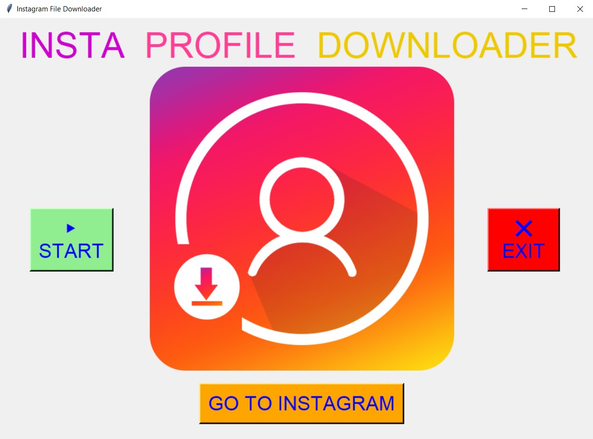 
  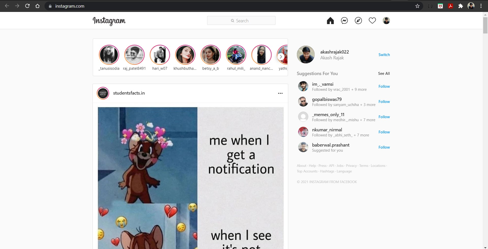 
  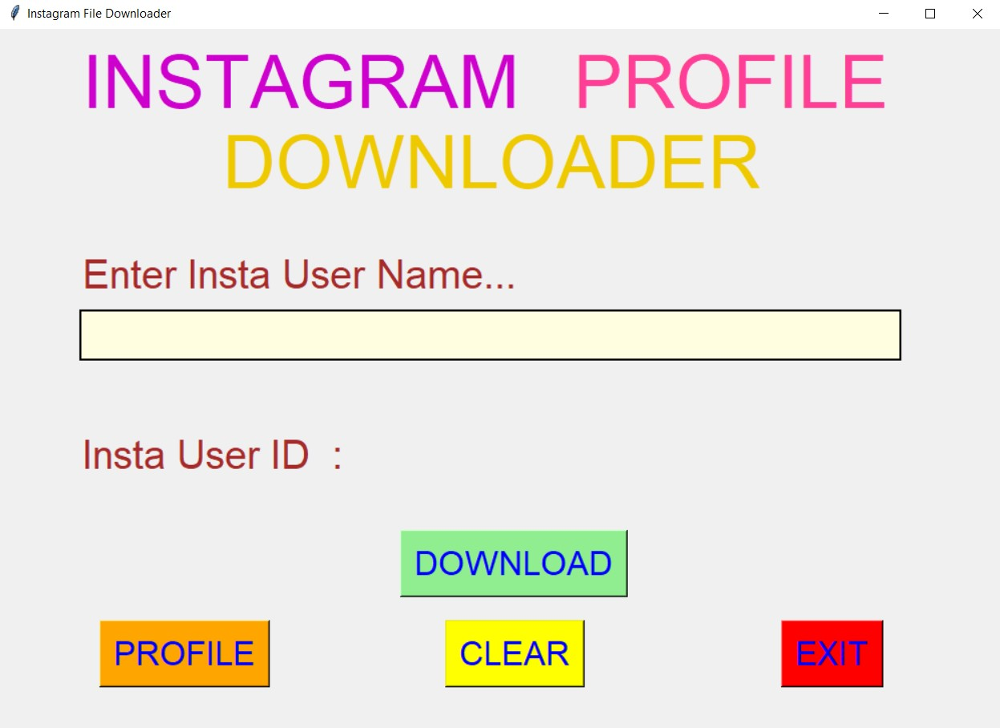 
  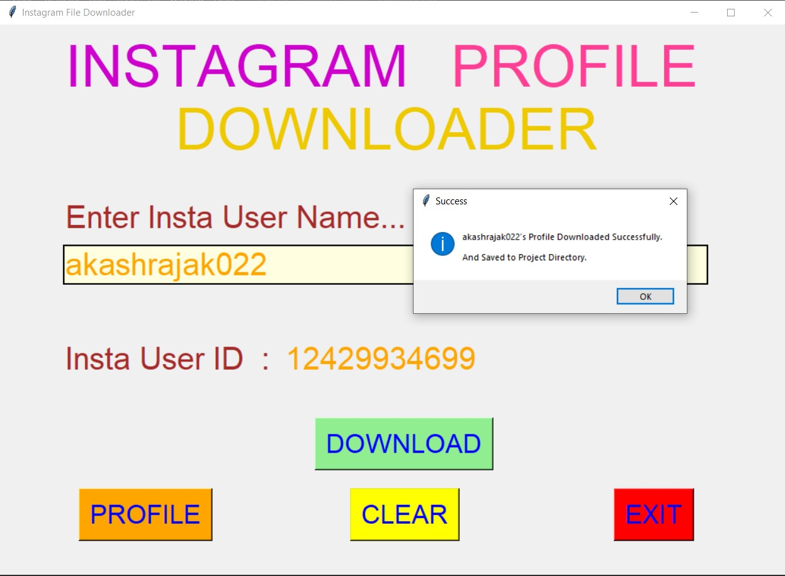 
  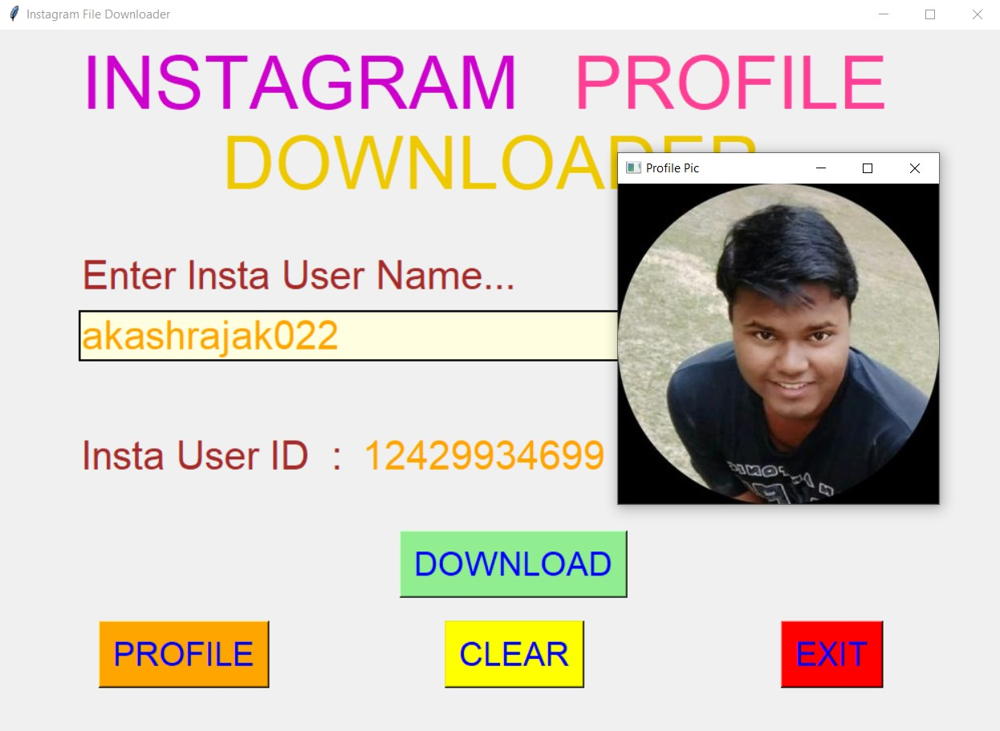 
  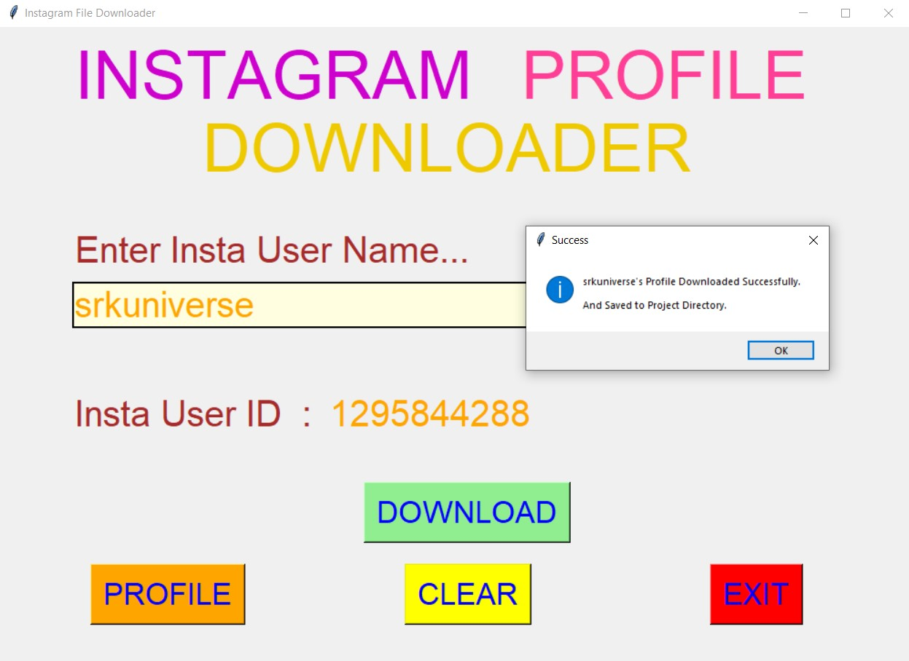 
  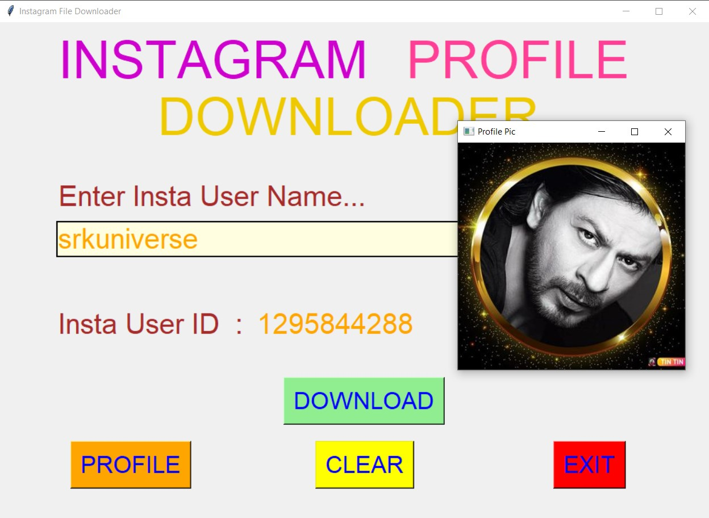 
  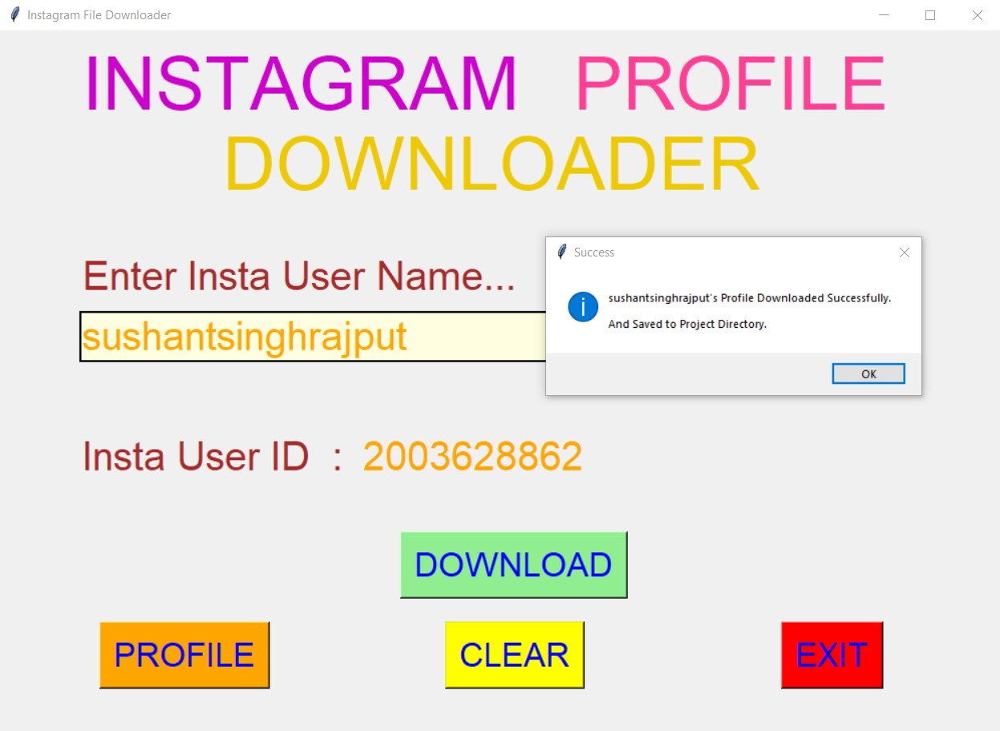 
  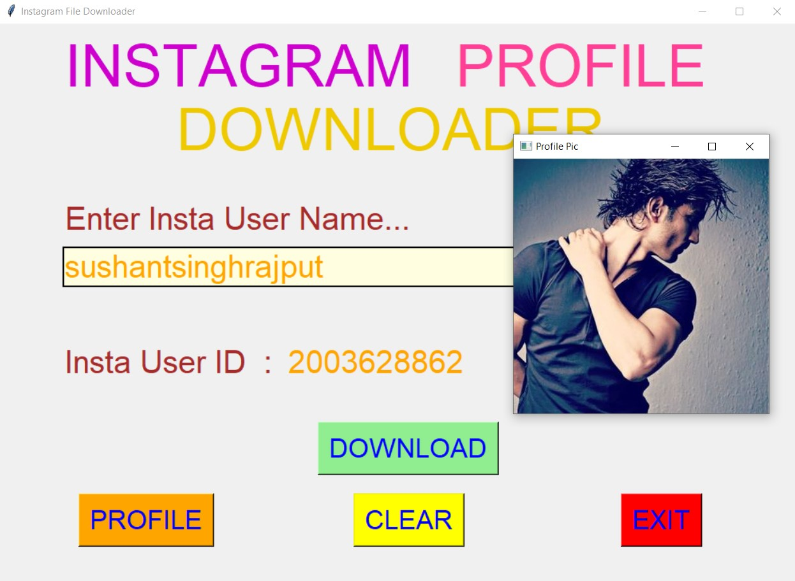 
  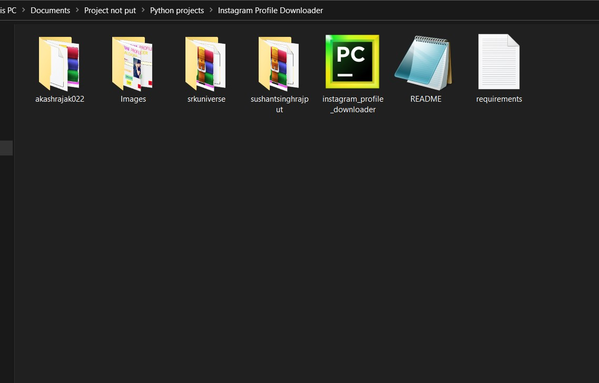 
  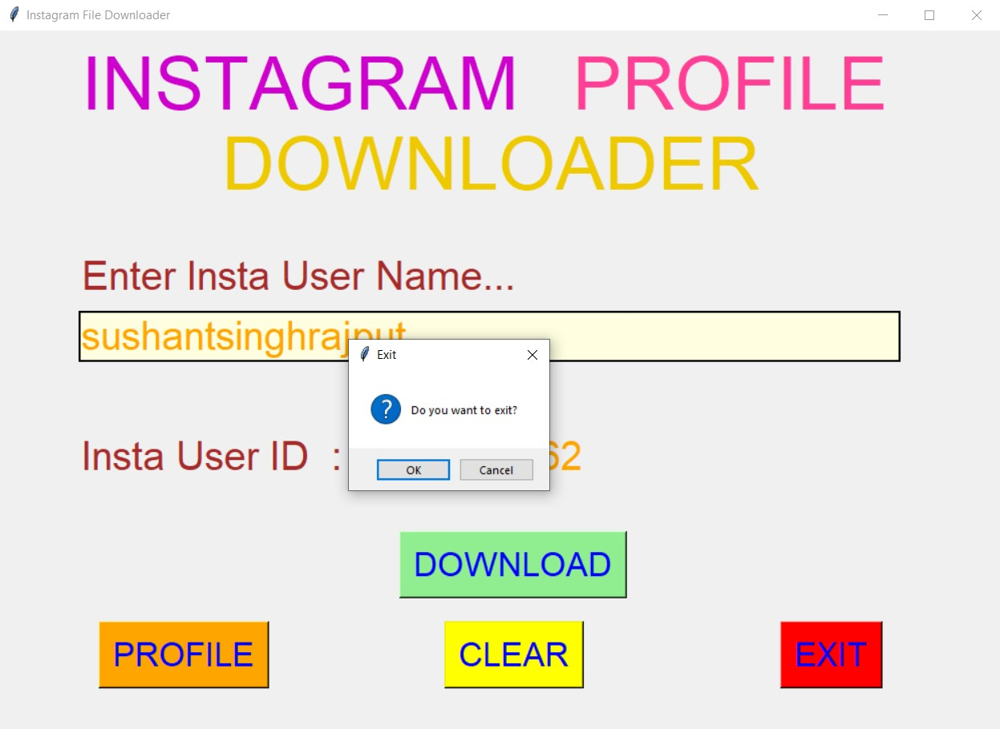 

****
<ol>
&copy; 2021 Akash Ramanand Rajak
</ol>
